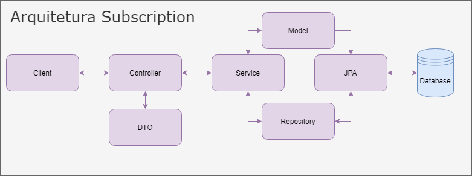

# Desafio Backend Java

## Indice 

[1. Decisões e Melhorias](#decises-e-melhorias)

[2. Tecnologias](#tecnologias)

[3. Arquitetura](#arquitetura)

[4. Rodando o Projeto](#rodando-o-projeto)


## Decisões e Melhorias
Para explicar melhor as minhas decisões comentei no código sobre cada parte do código que fiz uma decisão relevante.

Para o funcionamento conforme a entrada, o histórico cria uma assinatura, mas acredito que o ideal seria está assinatura já ter o cadastro e ter somente uma validação.

Gostaria também de estudar mais arquitetura de projetos e boas práticas, para saber aplicar melhor ao projeto e ter certeza de qual a arquitetura ideal para ele. 

Todos os testes que fiz foram manuais, testes é algo que necessito estudar para usar nas aplicações.

Escolhi deixar o retorno quando salvo uma assinatura das informações completas para melhor demonstração, mas em um caso real deveria ser avaliada as informações que necessitam ser retornada primeiro.

Gostaria de estudar a possibilidade de usar o lombok, encontrei informações divergentes e preferia não usar ele e fazer os métodos de Getters e Setters no código. 


## Tecnologias
Conforme solicitado no desafio foi utilizado as seguintes tecnologias:
1. Java 11
2. Spring Framework
3. Database: MySQL
4. Database testes: H2

## Arquitetura
Para esta aplicação foi adotado o modelo MVC, optei por fazer com camadas de DTO e Service para diminuir a repetição de código e separar melhor as responsabilidades de cada classe.


## Rodando o Projeto

1. Clone o repositório
   
   ```https://github.com/Siglyane/subscriptions-test.git```
   

2. Crie um arquivo ```application-dev.properties```
   
   Também pode criar um arquivo application-test.properties para alterar o perfil utilizado ou passar as informações para conectar na sua database direto no application.properties.
   No application.properties possui samples para conecta com o H2 ou MySQL.
   
   
2. Execute por qualquer IDE
   

3. Acesse o endpoint
```http://localhost:8080/history```
   
### Endpoints e métodos HTTP
- GET: Retorna todos os eventos salvos.
  ```/history```
  
- POST: Cria (compra) uma nova assinatura.
  ```/history```
  
- PATCH: Cancela assinatura.
  ```/cancel```
  
- PATCH: Recompra uma assinatura.
  ```/restart```

   

