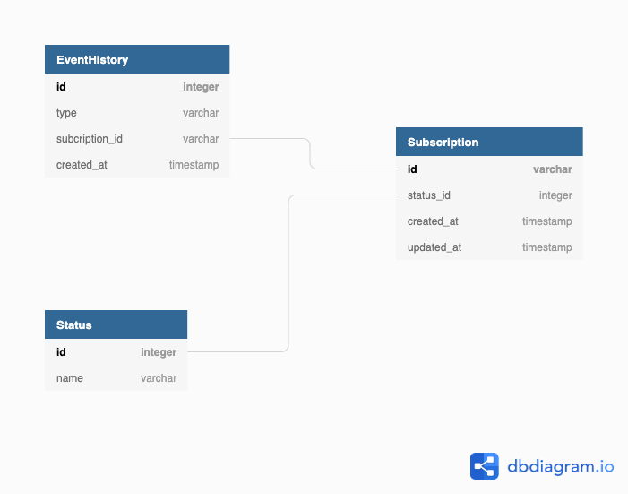

# Desafio Backend Java

## Rodando o projeto

## Coloque aqui as informacoes necessarias para que possamos rodar o projeto.
Exemplo: Precisa ter um banco MySQL com o schema XXXX criado

## O Desafio
### O desafio se trata de atualização da assinatura do usuário de acordo com notificações.

Onde deve ter um endpoint de entrada das notificações, sendo salvo os eventos e as assinaturas (subscriptions)

#### Tipos de Notificações:

-  SUBSCRIPTION_PURCHASED - A Compra foi realizada e a assinatura deve estar com status ativa.
-  SUBSCRIPTION_CANCELED - A Compra foi cancelada e a assinatura deve estar com status cancelada.
-  SUBSCRIPTION_RESTARTED - A Compra foi recuperada e a assinatura deve estar com status ativa.

### Etapas

- Recebimento Notificação HTTP
- Processamento e Persistencia

## Considerações Gerais
Você deverá usar este repositório como o repo principal do projeto, ou seja,
todos os seus commits devem estar registrados aqui, pois queremos ver como
você trabalha.

Esse problema tem algumas constraints:

1. Linguagem : Java 8 ou mais atualizada
2. Framework: Spring
3. Database: Qualquer database relacional
4. Devemos ser capazes de executar o seu código em um ambiente local

Qualquer dependência que eu precisar você tem que prover.

**Registre tudo**: testes que forem executados, ideias que gostaria de
implementar se tivesse tempo (explique como você as resolveria, se houvesse
tempo), decisões que forem tomadas e seus porquês, arquiteturas que forem
testadas, os motivos de terem sido modificadas ou abandonadas, instruções de
deploy e instalação, etc. Pode ser criado um único arquivo COMMENTS.md ou HISTORY.md no
repositório para isso.

## Modelo do Banco de Dados

## Execução
Após as inicialização do ambiente(Aplicação), enviar as Notificações e espera-se que o status da assinatura esteja conforme as notificações recebidas, além disso deve ter conter todo o histórico de notificações para cada assinatura para um possível auditoria.

### O que será avaliado na sua solução?

-  Seu código será observado por uma equipe de desenvolvedores que avaliarão a
   implementação do código, simplicidade e clareza da solução, a arquitetura,
   estilo de código, testes unitários, testes funcionais, nível de automação
   dos testes, o design da interface e a documentação.
   
- Consistência dos dados persistidos.

### Dicas

- Use qualquer ferramenta dentro framework Spring

- Automatize o máximo possível;

- Em caso de dúvidas, pergunte.